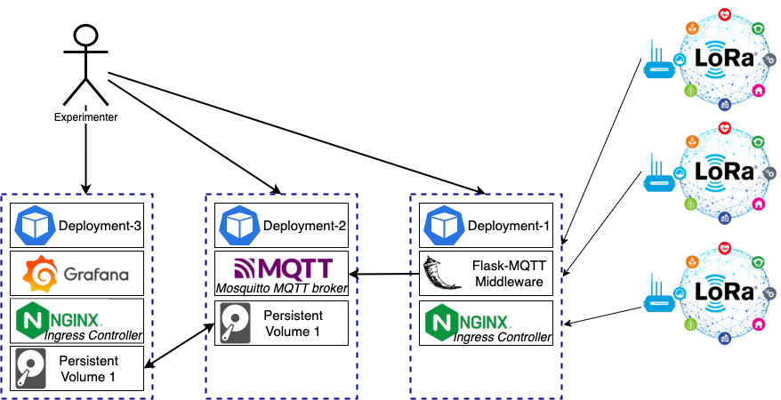
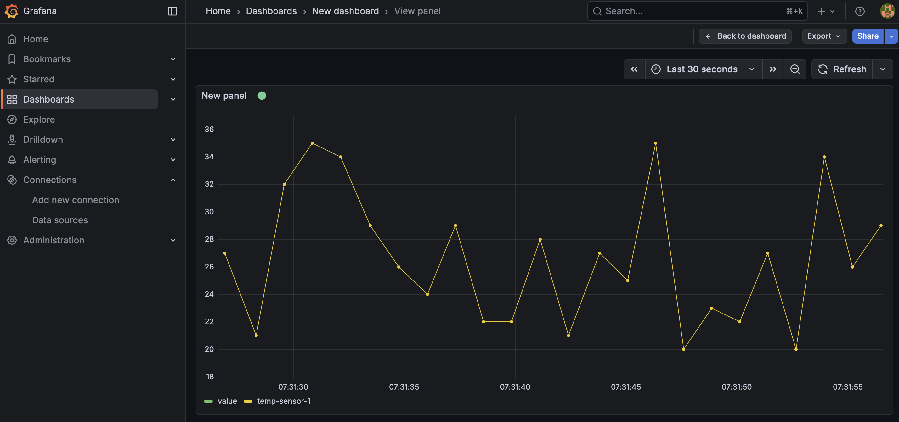

# KubeRNP Python Client Library

## Overview

This is the implementation of a Python library, otherwise known as
"KubeRNP", for interacting with RNP Kubernetes cluster.

You can use this lib with a JupyterHub instance or directly our your
Python SDE. Docs can be found here (TBD).

## Installing KubeRNP

You can install released versions of KubeRNP from PyPI

```
pip install kubernp
```

If you need the current development version of KubeRNP, install it from
the git repository:

```
pip install git+https://github.com/hackinsdn/kubernp@main
```

Due to the number of dependencies, we recommend install KubeRNP in a
virtual environment.

**NOTE**: This package has been tested and verified to work with Python
versions 3.11+

## Using KubeRNP

Once installed, you can use KubeRNP in your Python projects:

```
from kubernp import KubeRNP

kubernp = KubeRNP()
kubernp.show_config()

exp = kubernp.create_experiment(name="my-webserver-experiment")
testweb = exp.create_deployment(name="testweb", image="nginx:latest", publish=[80])
testweb.exec("echo '<h1>Hello World</h1>' > /usr/share/nginx/html/index.html")
endpoints = testweb.get_endpoints()

# get URL from endpoints

import requests
requests.get("http://" + endpoints["80-tcp"][0]).text

kubernp.list_experiments()
existing_exp = kubernp.load_experiment("another-existing-exp")
existing_exp.list_resources()
another_dep = existing_exp.get_resource("Deployment/another")
another_dep.cmd("whoami")

kubernp.delete_experiment("another-existing-exp")
```

Create a Pod with **nodeAffinity** and upload files
```
>>> from kubernp import KubeRNP
>>> kubernp = KubeRNP()
>>> exp = kubernp.create_experiment()
>>> pod1 = exp.create_pod("pod1", image="debian:11", command=["/usr/bin/tail", "-f", "/dev/null"], node_affinity="whx-ba")
>>> pod1.upload_files("~/work/scripts")
Uploading: 100.00% (0.02 MB / 0.02 MB) @ 26.82 MB/s
Upload completed! Saved to /uploads

>>> print(p1.exec("ls -la /uploads"))
total 12
drwxrwxrwx 3 root root    4096 Dec 27 08:31 .
drwxr-xr-x 1 root root    4096 Dec 27 08:30 ..
drwxr-xr-x 2  501 dialout 4096 Dec 27 08:31 scripts

# you can also define affinity by providing the manifest part to be merged:

>>> p1 = exp.create_pod(
        "pod1",
        image="debian:11",
        command=["/usr/bin/tail", "-f", "/dev/null"],
        manifest={'spec': {"affinity": {'nodeAffinity': {'requiredDuringSchedulingIgnoredDuringExecution': {
            'nodeSelectorTerms': [{'matchExpressions': [
                {'key': 'kubernetes.io/hostname', 'operator': 'In', 'values': ['whx-rj01']}
            ]
        }]}}}}}
    )
```

Example 2: IoT architecture for environmental monitoring

A common IoT architecture for environmental monitoring involves devices like Raspberry Pi as sensor nodes, a Mosquitto MQTT broker for communication, a data processing/storage layer, and a Grafana dashboard for visualization. This example will demonstrate how to setup such scenario. The figure below ilustrates the example.



One can leverage the KubeRNP library to setup the scenario above:

```
$ python3

from kubernp import KubeRNP
kubernp = KubeRNP(kubeconfig="~/.kube/config-other-cluster")

exp = kubernp.create_experiment("grafana-mqtt-exp")

mqtt_broker = exp.create_deployment(
    name="mosquitto",
    image="eclipse-mosquitto:2.0.15",
    publish=[{"port": 1883, "type": "ClusterIP"}],
    configmap={
        "name": "mosquitto-config",
        "literals": {"mosquitto.conf": "listener 1883 0.0.0.0\nallow_anonymous true\nlog_dest stdout\npersistence true\npersistence_location /mosquitto/data/"},
        "mount_path": "/mosquitto/config/mosquitto.conf",
        "mount_subpath": "mosquitto.conf"
    },
    pvc={
        "name": "pvc-grafana-mqtt",
        "storage_request": "1Gi",
        "mount_path": "/mosquitto/data",
        "mount_subpath": "mosquitto"
    },
)

grafana = exp.create_deployment(
    name="grafana-mqtt",
    image="grafana/grafana:latest",
    publish_http=[{"service_port": 3000, "host": "grafana-mqtt.k8s-testing.amlight.net", "enable_tls": True}],
    pvc={
        "name": "pvc-grafana-mqtt",
        "mount_path": "/var/lib/grafana",
        "mount_subpath": "grafana"
    },
    init_command="chown 472 /var/lib/grafana"
)

flaskapp = exp.create_deployment(
    name="flask-app",
    image="python:3.11",
    publish_http=[{"service_port": 5000, "host": "flask-mqtt-middleware.k8s-testing.amlight.net"}]
)

# wait a few minutes and check for the resources

exp.list_resources()

# You will notice that the flaskapp Deployment has STATUS=0/1 which indicates the the Pod
# has a problem and is not ready. Let's check the Pods for our Experiment:

exp.list_pod()

# You will notice that the flaskapp Pod has a CrashLoopBackOff state, which is not good!
# The problem is that we didnt add the command/args, so the container wont do anything!
# We left that on purpose to demonstrate the update of the deployment. Let's fix it:

k8s_obj = flaskapp.get_k8s()
k8s_obj.spec.template.spec.containers[0].command = ["sleep"]
k8s_obj.spec.template.spec.containers[0].args = ["infinity"]
flaskapp.update_k8s(k8s_obj)

# wait a few seconds and check for the resources

exp.list_resources()

# Now the flask-app Deployment should report STATUS=1/1!
# Let's continue to setup the Flask-MQTT middleware

print(flaskapp.exec("pip install flask flask-mqtt"))

flaskapp.upload_files("~/work/kubernp/misc/flask-mqtt.py")

print(flaskapp.exec("ls /uploads/"))

flaskapp.exec("python3 /uploads/flask-mqtt.py &")

print(flaskapp.exec("ps aux"))

# You should see the python3 process running our flask-mqtt.py middleware app
# Now we will do some configs on Grafana. Leave this terminal open, we will
# return to it soon
```

Configure Grafana to use the MQTT data source: You will need to install the MQTT data source plugin and configure it within Grafana's UI.

Open Grafana on your web browser and enter the URL https://grafana-mqtt.k8s-testing.amlight.net (created with the NGINX Ingress as requested with the `publish_http` argument). You should be able to login with credentials **admin** / **admin**.

Install the MQTT Plugin: Navigate to Connections -> Add new connection -> Data sources and search for "MQTT". Click on Install to install the [official MQTT Datasource for Grafana](https://grafana.com/grafana/plugins/grafana-mqtt-datasource/).

Once installed, configure the Data Source by clicking in "Add new data source": In the plugin settings, specify the MQTT broker's address as `tcp://srv-mosquitto-clusterip:1883`. The name `srv-mosquitto-clusterip` is the Kubernetes internal DNS to resolve the service name within the same namespace (the DNS resolver will complete the DNS hostname with the proper FQDN for the namespace and cluster domain).

You should see a message "MQTT Connected". The next step will be creating a very basic Dashboard to visualize data. Click on "building a dashboard" link. You will see a message "Start your new dashboard by adding a visualization", click on "Add visualization" and then choose the "grafana-mqtt-datasource (default)". On the query A, enter the Topic = "sensor/temperature" (this is just a topic name we will use for our test). Then save the Dashboard and click to visualize the Dashboard (tip: choose the "Last 30 seconds" on the time interval, to see the results more clearly).

Finally, let's simulate some IoT devices reporting data to the monitoring system we just configured. You can open a new Terminal and run the following command to simulate one device sending data to the system:

```
curl -X POST -H 'Content-type: application/json' http://flask-mqtt-middleware.k8s-testing.amlight.net/publish -d '{"topic": "sensor/temperature", "name": "temp_sensor", "value": 28}'
```

Back to Grafana Dashboard, you should see a new measurement point being displayed!

Run the following script to continuasly POST random data every one second:

```
python3 ~/work/kubernp/misc/mqtt-send-data.py http://flask-mqtt-middleware.k8s-testing.amlight.net/publish 
```

Now your Grafana Dashboard should look like:



To finish our experiment, we will delete the experiment to release all resources allocated. On the Python console:
```
from kubernp import KubeRNP
kubernp = KubeRNP(kubeconfig="~/.kube/config-other-cluster")

kubernp.delete_experiment("grafana-mqtt-exp")
```

