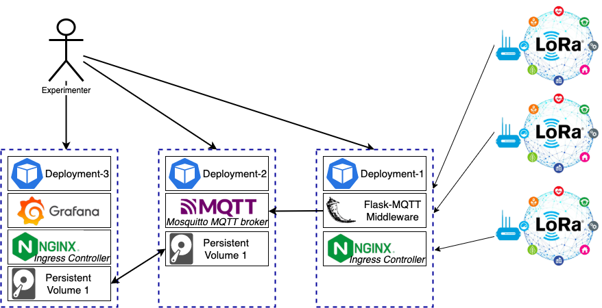
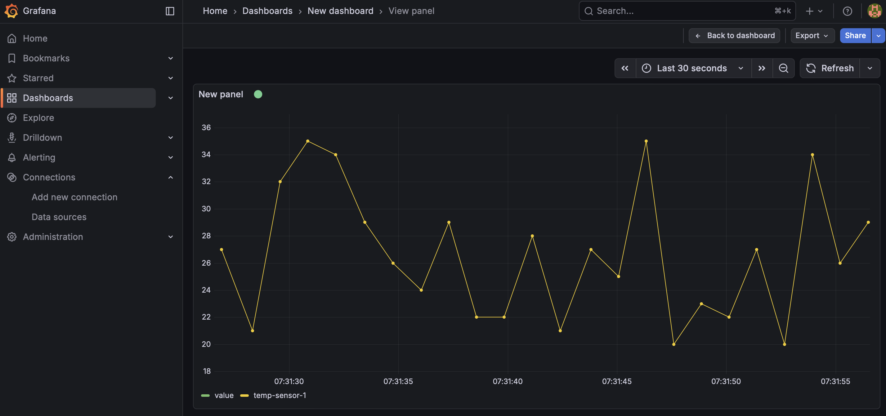
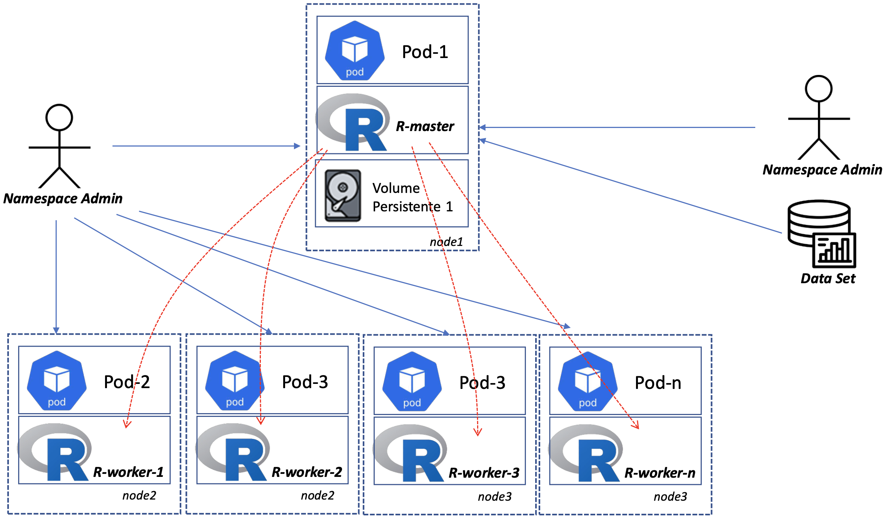
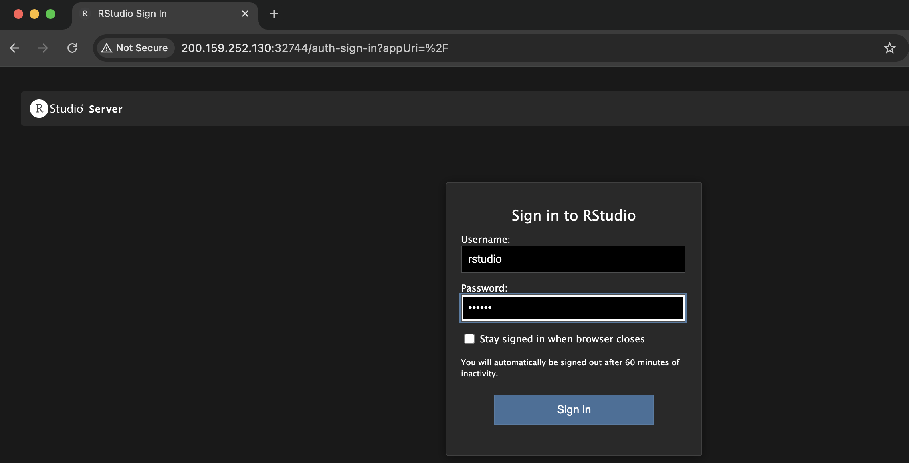
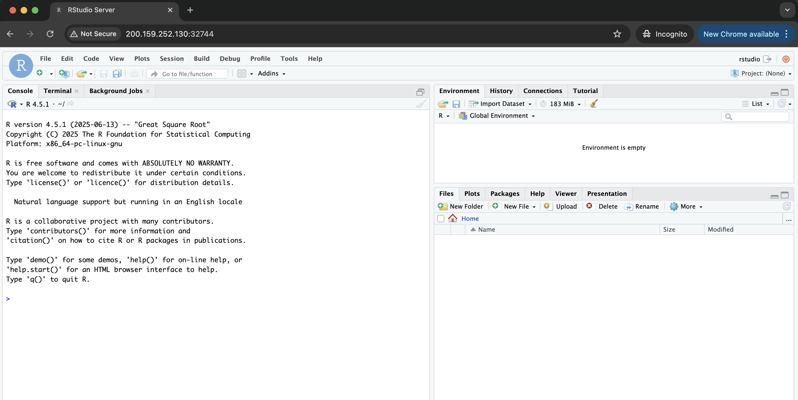
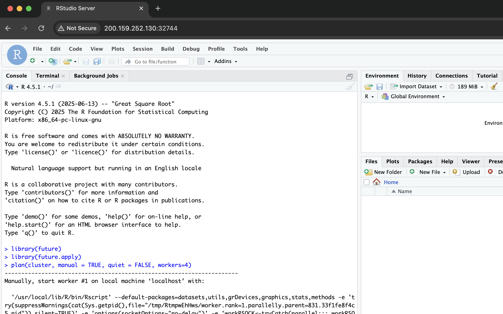
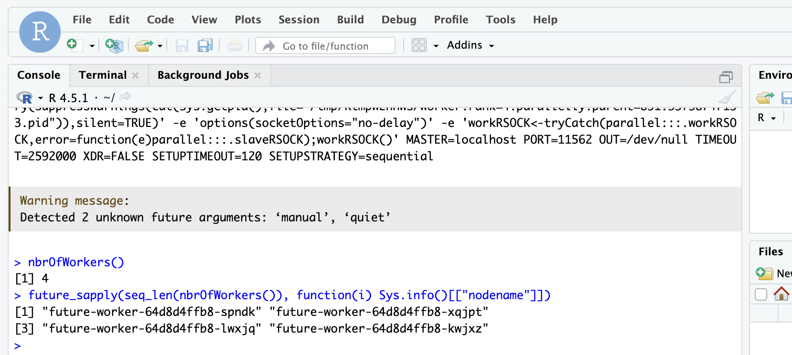
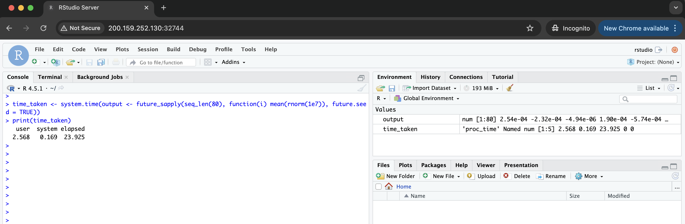
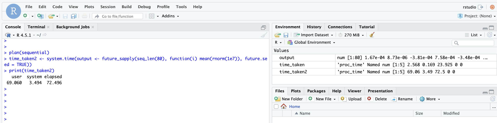

# KubeRNP Python Client Library

## Overview

This is the implementation of a Python library, otherwise known as
"KubeRNP", for interacting with RNP Kubernetes cluster.

You can use this lib with a JupyterHub instance or directly our your
Python SDE. Docs can be found here (TBD).

## Installing KubeRNP

You can install released versions of KubeRNP from PyPI

```
pip install kubernp
```

If you need the current development version of KubeRNP, install it from
the git repository:

```
pip install git+https://github.com/hackinsdn/kubernp@main
```

Due to the number of dependencies, we recommend install KubeRNP in a
virtual environment.

**NOTE**: This package has been tested and verified to work with Python
versions 3.11+

## Using KubeRNP

Once installed, you can use KubeRNP in your Python projects:

```
from kubernp import KubeRNP

kubernp = KubeRNP()
kubernp.show_config()

exp = kubernp.create_experiment(name="my-webserver-experiment")
testweb = exp.create_deployment(name="testweb", image="nginx:latest", publish=[80])
testweb.exec("echo '<h1>Hello World</h1>' > /usr/share/nginx/html/index.html")
endpoints = testweb.get_endpoints()

# get URL from endpoints

import requests
requests.get("http://" + endpoints["80-tcp"][0]).text

kubernp.list_experiments()
existing_exp = kubernp.load_experiment("another-existing-exp")
existing_exp.list_resources()
another_dep = existing_exp.get_resource("Deployment/another")
another_dep.cmd("whoami")

kubernp.delete_experiment("another-existing-exp")
```

Create a Pod with **nodeAffinity** and upload files
```
>>> from kubernp import KubeRNP
>>> kubernp = KubeRNP()
>>> exp = kubernp.create_experiment()
>>> pod1 = exp.create_pod("pod1", image="debian:11", command=["/usr/bin/tail", "-f", "/dev/null"], node_affinity="whx-ba")
>>> pod1.upload_files("~/work/scripts")
Uploading: 100.00% (0.02 MB / 0.02 MB) @ 26.82 MB/s
Upload completed! Saved to /uploads

>>> print(p1.exec("ls -la /uploads"))
total 12
drwxrwxrwx 3 root root    4096 Dec 27 08:31 .
drwxr-xr-x 1 root root    4096 Dec 27 08:30 ..
drwxr-xr-x 2  501 dialout 4096 Dec 27 08:31 scripts

# you can also define affinity by providing the manifest part to be merged:

>>> p1 = exp.create_pod(
        "pod1",
        image="debian:11",
        command=["/usr/bin/tail", "-f", "/dev/null"],
        manifest={'spec': {"affinity": {'nodeAffinity': {'requiredDuringSchedulingIgnoredDuringExecution': {
            'nodeSelectorTerms': [{'matchExpressions': [
                {'key': 'kubernetes.io/hostname', 'operator': 'In', 'values': ['whx-rj01']}
            ]
        }]}}}}}
    )
```

Example 2: IoT architecture for environmental monitoring

A common IoT architecture for environmental monitoring involves devices like Raspberry Pi as sensor nodes, a Mosquitto MQTT broker for communication, a data processing/storage layer, and a Grafana dashboard for visualization. This example will demonstrate how to setup such scenario. The figure below ilustrates the example.



One can leverage the KubeRNP library to setup the scenario above:

```
$ python3

from kubernp import KubeRNP
kubernp = KubeRNP(kubeconfig="~/.kube/config-other-cluster")

exp = kubernp.create_experiment("grafana-mqtt-exp")

mqtt_broker = exp.create_deployment(
    name="mosquitto",
    image="eclipse-mosquitto:2.0.15",
    publish=[{"port": 1883, "type": "ClusterIP"}],
    configmap={
        "name": "mosquitto-config",
        "literals": {"mosquitto.conf": "listener 1883 0.0.0.0\nallow_anonymous true\nlog_dest stdout\npersistence true\npersistence_location /mosquitto/data/"},
        "mount_path": "/mosquitto/config/mosquitto.conf",
        "mount_subpath": "mosquitto.conf"
    },
    pvc={
        "name": "pvc-grafana-mqtt",
        "storage_request": "1Gi",
        "mount_path": "/mosquitto/data",
        "mount_subpath": "mosquitto"
    },
)

grafana = exp.create_deployment(
    name="grafana-mqtt",
    image="grafana/grafana:latest",
    publish_http=[{"service_port": 3000, "host": "grafana-mqtt.k8s-testing.amlight.net", "enable_tls": True}],
    pvc={
        "name": "pvc-grafana-mqtt",
        "mount_path": "/var/lib/grafana",
        "mount_subpath": "grafana"
    },
    init_command="chown 472 /var/lib/grafana"
)

flaskapp = exp.create_deployment(
    name="flask-app",
    image="python:3.11",
    publish_http=[{"service_port": 5000, "host": "flask-mqtt-middleware.k8s-testing.amlight.net"}]
)

# wait a few minutes and check for the resources

exp.list_resources()

# You will notice that the flaskapp Deployment has STATUS=0/1 which indicates the the Pod
# has a problem and is not ready. Let's check the Pods for our Experiment:

exp.list_pod()

# You will notice that the flaskapp Pod has a CrashLoopBackOff state, which is not good!
# The problem is that we didnt add the command/args, so the container wont do anything!
# We left that on purpose to demonstrate the update of the deployment. Let's fix it:

k8s_obj = flaskapp.get_k8s()
k8s_obj.spec.template.spec.containers[0].command = ["sleep"]
k8s_obj.spec.template.spec.containers[0].args = ["infinity"]
flaskapp.update_k8s(k8s_obj)

# wait a few seconds and check for the resources

exp.list_resources()

# Now the flask-app Deployment should report STATUS=1/1!
# Let's continue to setup the Flask-MQTT middleware

print(flaskapp.exec("pip install flask flask-mqtt"))

flaskapp.upload_files("~/work/kubernp/misc/flask-mqtt.py")

print(flaskapp.exec("ls /uploads/"))

flaskapp.exec("python3 /uploads/flask-mqtt.py &")

print(flaskapp.exec("ps aux"))

# You should see the python3 process running our flask-mqtt.py middleware app
# Now we will do some configs on Grafana. Leave this terminal open, we will
# return to it soon
```

Configure Grafana to use the MQTT data source: You will need to install the MQTT data source plugin and configure it within Grafana's UI.

Open Grafana on your web browser and enter the URL https://grafana-mqtt.k8s-testing.amlight.net (created with the NGINX Ingress as requested with the `publish_http` argument). You should be able to login with credentials **admin** / **admin**.

Install the MQTT Plugin: Navigate to Connections -> Add new connection -> Data sources and search for "MQTT". Click on Install to install the [official MQTT Datasource for Grafana](https://grafana.com/grafana/plugins/grafana-mqtt-datasource/).

Once installed, configure the Data Source by clicking in "Add new data source": In the plugin settings, specify the MQTT broker's address as `tcp://srv-mosquitto-clusterip:1883`. The name `srv-mosquitto-clusterip` is the Kubernetes internal DNS to resolve the service name within the same namespace (the DNS resolver will complete the DNS hostname with the proper FQDN for the namespace and cluster domain).

You should see a message "MQTT Connected". The next step will be creating a very basic Dashboard to visualize data. Click on "building a dashboard" link. You will see a message "Start your new dashboard by adding a visualization", click on "Add visualization" and then choose the "grafana-mqtt-datasource (default)". On the query A, enter the Topic = "sensor/temperature" (this is just a topic name we will use for our test). Then save the Dashboard and click to visualize the Dashboard (tip: choose the "Last 30 seconds" on the time interval, to see the results more clearly).

Finally, let's simulate some IoT devices reporting data to the monitoring system we just configured. You can open a new Terminal and run the following command to simulate one device sending data to the system:

```
curl -X POST -H 'Content-type: application/json' http://flask-mqtt-middleware.k8s-testing.amlight.net/publish -d '{"topic": "sensor/temperature", "name": "temp_sensor", "value": 28}'
```

Back to Grafana Dashboard, you should see a new measurement point being displayed!

Run the following script to continuasly POST random data every one second:

```
python3 ~/work/kubernp/misc/mqtt-send-data.py http://flask-mqtt-middleware.k8s-testing.amlight.net/publish 
```

Now your Grafana Dashboard should look like:



To finish our experiment, we will delete the experiment to release all resources allocated. On the Python console:
```
from kubernp import KubeRNP
kubernp = KubeRNP(kubeconfig="~/.kube/config-other-cluster")

kubernp.delete_experiment("grafana-mqtt-exp")
```

Example 3: Leverage the Kubernetes cluster to run distributed processing in R

The primary goal of this lab is to demonstrate the integration of the `future` package
in R with a Kubernetes cluster to facilitate scalable parallel computing. By
transitioning from local processing to a distributed environment, the lab aims to show
how researchers can dynamically allocate resources in the Kubernetes cluster to meet the
computational demands of a task. Ultimately, the objective is to establish a flexible,
high-performance workflow that leverages Kubernetes infrastructure to overcome the hardware
limitations of a single machine.

The following image outlines the scenario and setup.



In a Kubernetes environment, the actual work is handled by pods, which function like individual
Linux containers. These pods live on nodes, which are virtual machines or physical servers provided
by the cloud operator. A major benefit of this setup is resiliency: if a pod fails, Kubernetes is
designed to automatically restart it, ensuring your computations continue without manual intervention.
Futhermore, the most significant advantage is the massive performance gain achieved by moving from a
single machine to a distributed cluster: by offloading R processing tasks to a Kubernetes cluster,
you move beyond the physical limits of your local CPU and RAM.

To make that happens, the R `future` package can treat each pod as an individual worker. Thus, tasks
that would normally run sequentially on your laptop are executed simultaneously across dozens or
even hundreds of cloud instances.

The basic steps are:

1. Setup an experiment on Kubernetes leveraging the KubeRNP library
2. Start the "pods of interest" using an example provided in this tutorial
3. Connect to the RStudio Server running in the Kubernetes cluster from your Internet browser
4. Prepare and run the experiment
5. Finish the experiment and release the resources

By "pods of interest" we mean: A) one (scheduler) pod for a main process that runs RStudio Server
and communicates with the workers; B) multiple (worker) pods, each with one R worker process to act
as the workers. All pods will be running the docker image `rocker/rstudio:4.5.1` which is commonly
used by the community.

Let's get started:

```
$ python3

from kubernp import KubeRNP
kubernp = KubeRNP(kubeconfig="~/.kube/config-other-cluster")

exp = kubernp.create_experiment("r-future-exp")
```

We will start by checking the Kubernetes cluster to make sure the nodes are healthy and can run our jobs (this can take a few seconds because it will run a actual job on each node to guarantee it is fully operational):

```
healthy, unhealthy = kubernp.healthcheck_nodes()
```

Now that we have the list of healthy nodes, we can use the Kubernetes Node Affinity feature to run our experiment on that nodes:

```
exp.create_from_file("misc/r-future-cluster.yaml", node_affinity=healthy)
exp.list_resources()
```

You should see a list of resources that were created based on the manifest provided as example (`misc/r-future-cluster.yaml`):

```
>>> exp.list_resources()
NAME                              UID                                   AGE    STATUS
--------------------------------  ------------------------------------  -----  --------
Deployment/future-scheduler       e4c48b09-afef-4413-a8f9-27e33bcf0c68  19s    1/1
Deployment/future-worker          6f2c0369-6ffe-49ac-820e-83d1232cd8d1  18s    4/4
Service/future-scheduler-master   b580d01c-e0bf-45ca-b876-4dcd7351163f  17s    --
Service/future-scheduler-rstudio  47371808-34d9-4f7f-8127-d0c921b2dae4  17s    --
```

Run the following command to get the URL that you will open your Internet browser to actually run the R experiment:

```
>>> exp.get_endpoints()
{'future-rstudio': ['200.159.252.130:32744']}
```

**Note**: you can also combine the Ingress feature as we demonstrated on previous example to have a nice URL with https on standard ports, rather than http on 32690 (which can be subject to firewall restrictions on many organizations).

Open the address returned (i.e, `http://200.159.252.130:32744`) on your Internet browser. If asked for username and password you can use: username - **rstudio** and password - **future**. You should see an image like this:



And after login, you should see this:



Now, on the RStudio console, let's start by importing the libraries we will use:

```
library(future)
library(future.apply)
```

Next, we will create a plan for the experiment, leveraging the remote workers to compose our cluster:

```
plan(cluster, manual = TRUE, quiet = FALSE, workers=4)
```

The parameter `manual = TRUE` above plays an important role to prevent the future package from
attempting to launch new R processes on the workers. This is necessary because Kubernetes has
already initialized these processes, which are currently idling and waiting to establish a
connection with the primary RStudio Server instance. With the parameter `workers=4` we setup
the plan to wait for 4 workers to connect. Finally, `quiet=FALSE` helps us seeing what is being
executed.

You should see an output like this:



After a few seconds, you can run the following command to check if all workers are running:

```
nbrOfWorkers()
future_sapply(seq_len(nbrOfWorkers()), function(i) Sys.info()[["nodename"]])
```

You should see the number of workers equals 4 and the name of each pod:



Notice that the name of the workers match the name of the pods we created, you can confirm that by running the following command on the Python console we started earlier:

```
>>> exp.list_pod()
KIND/NAME                             STATUS    AGE    NODE    IP
------------------------------------  --------  -----  ------  -------------
Pod/future-scheduler-dcc577d46-lr5cg  Running   15m    ids-rj  10.50.24.2
Pod/future-worker-64d8d4ffb8-kwjxz    Running   15m    ids-rn  10.50.124.182
Pod/future-worker-64d8d4ffb8-lwxjq    Running   15m    whx-rn  10.50.22.203
Pod/future-worker-64d8d4ffb8-spndk    Running   15m    ids-rj  10.50.24.42
Pod/future-worker-64d8d4ffb8-xqjpt    Running   15m    ids-pb  10.50.63.154
```

Next we will actually run the R experiment leveraging the distributed processing. For our demonstration, we will run a very simple calculation consisting of calculating the mean of 10 milion random numbers eithy times in parallel (we will also measure the time taken for comparison purposes). On your browser running RStudio:

```
time_taken <- system.time(output <- future_sapply(seq_len(80), function(i) mean(rnorm(1e7)), future.seed = TRUE))
print(time_taken)
```

You should see this:



Finally, just for the sake of comparison, we can run the same experiment in a sequencial strategy to check how long it will take:

```
plan(sequential)
time_taken2 <- system.time(output <- future_sapply(seq_len(80), function(i) mean(rnorm(1e7)), future.seed = TRUE))
print(time_taken2)
```

Expected output:



You should see that the time is much higher, which makes sense, since we compared a distributed execution with 4 workers versus a sequential execution with just one workers. One could even explore more this experiment by combining `multisession` and `cluster` parallel strategies which will explore more cores available on each worker. 

Finally, we can finish the experiment and release the resources on the Python console:

```
exp.finish()
```
